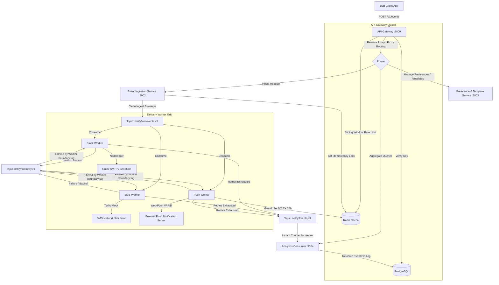

# NotifyFlow — Distributed Multi-Tenant B2B Notification Engine

### 🌐 Live Demo & Deployments
* **Frontend Sandbox Dashboard**: [https://notifyflow-frontend.vercel.app/](https://notifyflow-frontend.vercel.app/)
* **Backend API Gateway**: [https://notifyflow-backend.onrender.com/health](https://notifyflow-backend.onrender.com/health)

---

NotifyFlow is a highly resilient, fault-tolerant, and high-throughput event-driven B2B notification platform. Engineered using a **decoupled, purified microservices topology**, it handles transactional messaging across **Email, SMS, and Web Push** channels with sub-millisecond ingestion rates, robust retry mechanisms, and real-time performance analytics.

---

## 🏗 System Architecture & Event Flow

The platform is designed to guarantee **zero cross-channel retry interference**, **idempotency limits**, and **caching strategies** to shield relational databases from aggregate query spikes.



### Key Architectural Highlights
1. **API Gateway (Reverse Proxy)**: Centrally controls reverse-proxy routing to microservices, checks authorization cryptographic key hashes, and implements Redis sliding-window rate limits (default: 60req/min per tenant).
2. **Purified Retry Topology**: Instead of polluting the primary `notifyflow.events.v1` topic with retry attempts, failing events are published to a isolated `notifyflow.retry.v1` topic. Every worker applies a custom **channel boundary tag** to route their retries without duplicate cross-channel interference.
3. **Idempotency Locks**: The Gateway and workers utilize Redis cache keys (`SET NX EX 86400`) to guarantee that duplicate client event submissions are discarded safely.
4. **Analytics Cache-Aside (10s TTL)**: Shields PostgreSQL from expensive relational aggregations under high dashboard load by caching metrics in Redis.

---

## 📂 Project Structure

NotifyFlow is structured as a clean, modular NPM workspace monorepo:

```text
├── services/
│   ├── api-gateway/            # Reverse proxy gateway, auth, and rate-limiting
│   ├── event-ingestion/        # Event schemas validation and Kafka ingestion
│   ├── preference-template/    # User preference persistence and templates resolution
│   ├── email-worker/           # Email channel processor + retry loop
│   ├── sms-worker/             # SMS Twilio/mock channel processor + retry loop
│   ├── push-worker/            # Web Push VAPID channel processor + retry loop
│   └── analytics-consumer/     # Kafka metrics consumer, DLQ tracker, and REST portal
├── shared/
│   └── kafka/                  # Shared Kafka client wrappers and connection logic
├── frontend/                   # Responsive Vite + React Dashboard Sandbox
├── migrations/                 # PostgreSQL structural table migrations
├── docker-compose.yml          # Container configuration for 7 services + Kafka/Redis/PG
└── test-e2e.js                 # Complete sequential multi-event integration test suite
```

---

## ⚡ Quick-Start Guide

### Prerequisites
Make sure you have [Docker Desktop](https://www.docker.com/products/docker-desktop/) and [Node.js](https://nodejs.org/) (v18+) installed.

### 1. Spin up the Stack (Docker Clustering)
To compile, boot, and cluster all 7 microservices along with PostgreSQL, Redis, and Kafka:

```bash
docker-compose up --build -d
```

*This command automatically triggers database health checks to ensure dependencies (Postgres/Kafka/Redis) are fully operational before Express applications boot.*

### 2. Run Database Migrations
Initialize database structures (Users, Tenants, Subscriptions, Templates, and Logs):

```bash
node run-migrations.js
```

### 3. Start the Frontend Sandbox Dashboard
Run the React development server locally on the host:

```bash
cd frontend
npm install
npm run dev
```
Open **`http://localhost:5173`** to access the responsive B2B metrics sandbox portal.

---

## 🧪 Testing and Verification Suite

NotifyFlow includes comprehensive automated validation scripts:

### 1. Sequential E2E Integration Suite
Dispatches 10 distinct event scenarios (delivered messages, skipped deliveries, templates resolution miss, duplicate payload conflict errors, and VAPID push DLQ redirection) and asserts database logging accuracy:

```bash
node test-e2e.js
```

### 2. Artillery Stress Load Test
Simulates peak traffic rates by pushing 200 virtual user payloads to `/v1/events` over 30 seconds:

```bash
npx artillery run load-test.yml
```

---

## 🛡 API Gateway Reference

### Ingest Event
* **Endpoint**: `POST /v1/events`
* **Headers**: `x-api-key: <cryptographic_credential_key>`
* **Payload**:
```json
{
  "clientEventId": "evt-unique-uuid-10928",
  "tenantId": "tenant-77777777-7777-4777-a777-777777777777",
  "userId": "user-e2e-opt-in",
  "eventType": "order.placed",
  "payload": {
    "name": "Acme Customer",
    "orderId": "ord-88190"
  }
}
```
* **Response**: `202 Accepted`

### Register User Preferences
* **Endpoint**: `POST /v1/users`
* **Headers**: `x-api-key: <cryptographic_credential_key>`
* **Payload**:
```json
{
  "userId": "user-cust-99",
  "email": "cust@company.com",
  "phone": "+1555019900"
}
```
* **Response**: `201 Created`
